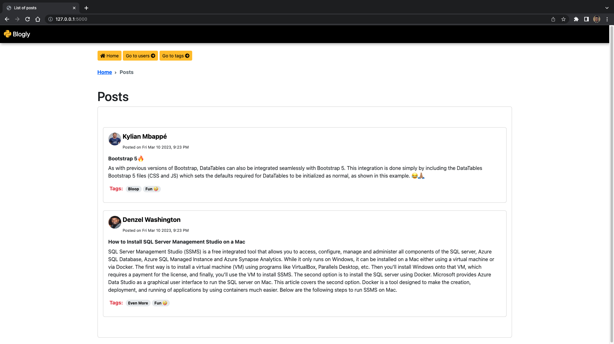

# Blogly

##########################################################################

## Part Three: Add M2M Relationship
The last part will be to add a “tagging” feature.

**Tag Model**

>The site will have a table of tags — there should be an SQLAlchemy model for this:
>
>**id**
>**name**, (unique!)

There should also be a model for PostTag, which joins together a Post and a Tag. It will have foreign keys for the both the post_id and tag_id. Since we don’t want the same post to be tagged to the same tag more than once, we’ll want the combination of post + tag to be unique. It also makes sense that neither the post_id nor tag_id can be null. Therefore, we’ll use a “composite primary key” for this table— a primary key made of more than one field. You may have to do some research to learn how to do this in SQLAlchemy.

Add relationships so you can see the .tags for a post, and the .posts for a tag.

STOP and play around with this feature in IPython before continuing.

## User Interface
**Add Tag**

_images/add-tag.png
**Edit Tag**

_images/edit-tag.png
**List Tag**

_images/list-tags.png
**Show Tag**

_images/show-tag.png
**Show Post With Tags**

_images/post-w-tags.png
**Add Post With Tags**

_images/add-post-w-tags.png
**Edit Post With Tags**

_images/edit-post-w-tags.png

## Add Routes
**GET /tags**
>Lists all tags, with links to the tag detail page.
GET /tags/[tag-id]
Show detail about a tag. Have links to edit form and to delete.
GET /tags/new
Shows a form to add a new tag.
POST /tags/new
Process add form, adds tag, and redirect to tag list.
GET /tags/[tag-id]/edit
Show edit form for a tag.
POST /tags/[tag-id]/edit
Process edit form, edit tag, and redirects to the tags list.
POST /tags/[tag-id]/delete
Delete a tag.
Update Routes for Posts
Update the route that shows a post so that it shows all the tags for that post.
>
>Update the routes for adding/editing posts so that it shows a listing of the tags and lets you pick which tag(s) apply to that post. (You can use whatever form element you want here: a multi-select, a list of checkboxes, or any other way you can solve this.
>

>**Hint**
>
>**Getting Multiple Values From Form**
>
>The normal way to get a value from a form, **request.form['key']**, only returns one value from this form. To get all of the values for that key in the form, you’ll want to investigate **.getlist**.

## Further Study
### Update Tag Add/Edit Forms
>Edit these forms to let you pick posts for this tag.
>
>Edit Tag With Posts
>
>_images/add-tag-with-posts.png
>Edit Tag With Posts

>_images/edit-tag-with-posts.png
>If you made a homepage, make this show tags, too:
>
>_images/homepage-w-tags.png
## Add Tests
Add tests for your most critical pages.

